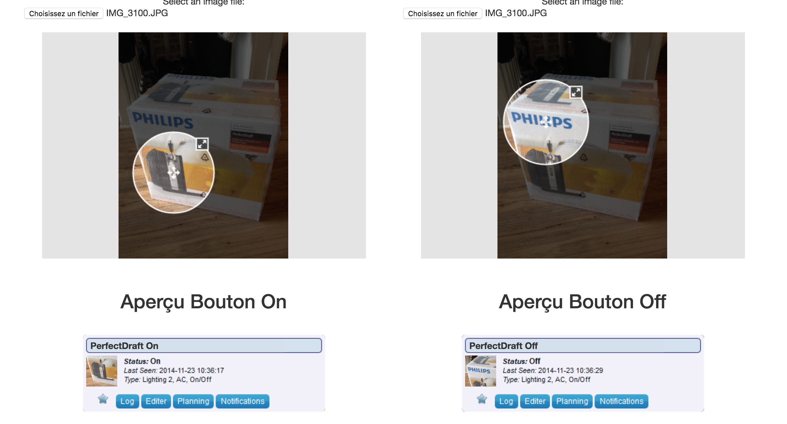

# 🤖 🆒 Domoticz custom icon generator

## [Demo](http://domoticz-icon.aurelien-loyer.fr/)

# Description

🤖 🆒 Domoticz custom icon generator, help people to generate custom icon, resize image, crop image 🔪, and generate zip folder 📦 to have amazing 🎉 icons in Domoticz app. 
If you want to contribute to this project: <a target="_blank" href="https://github.com/T3kstiil3/domoticz_custom_icon_generator">Github 🐙</a> or contact me on <a target="_blank" href="https://twitter.com/AurelienLoyer">Twitter 🐦</a>

 Enjoy 🤩

# Preview

# TODO

- [x] Integrate AngularJs
- [x] Convert Div -> Canvas -> image/png
- [x] Zip all files
- [x] Multi Language
- [ ] Image custom (border,border-radius)
- [ ] Image blur
- [ ] Resolve Bug Retina
- [ ] News features ?
